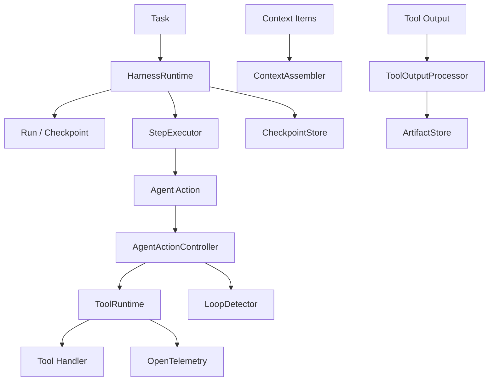

# Reliable Agent Harness for Long-Horizon Tool-Using Agents

A business-agnostic reliability runtime for long-horizon tool-using
agents.

The harness separates agent reasoning from execution reliability:
the agent decides what to do, while the runtime governs state,
retries, recovery, loops, context, tool execution, and observability.

## Why This Exists

Long-horizon tool-using agents fail in predictable ways: transient
tool errors, timeouts, process interruptions, infinite loops,
context overflow, and lost work after crashes. A naive execution
loop has no recovery for any of these.

This project provides a deterministic runtime layer that makes
execution state explicit, recovers from retryable failures, detects
loops, bounds context, externalizes large outputs, and integrates
external tools through MCP — all verified through controlled
benchmarks with real filesystem and real pytest subprocess workloads.

## What the Harness Provides

- Explicit Task / Run / Checkpoint state
- Checkpoint-boundary recovery (resume creates a new Run)
- Timeout handling and side-effect-aware retries
- Loop detection and deterministic replan gating
- Bounded context selection with must_keep semantics
- Large tool-output externalization to ArtifactStore
- MCP tool integration through a unified ToolRegistry
- Privacy-aware OpenTelemetry tracing
- Deterministic Naive-vs-Reliable benchmarks
- Real filesystem + real pytest subprocess workloads

## Architecture



See [ARCHITECTURE.md](ARCHITECTURE.md) for the full design and
invariants.

## Reliability Model

- Retries happen inside one logical ToolCall.
- Safe retries depend on side-effect classification (READ_ONLY and
  IDEMPOTENT auto-retry; SIDE_EFFECTING does not).
- Resume creates a new Run — the old Run stays in its terminal state.
- Checkpointed steps are not replayed.
- An interrupted, uncheckpointed step may be legally replayed.
- Recovery is checkpoint-boundary recovery, not exactly-once
  external-side-effect execution.

## Benchmark Design

The benchmark is primarily **deterministic mechanism verification**
and **integration validation**. It is not a statistical LLM
benchmark.

A deliberately naive baseline (sequential execution, `max_attempts=1`,
no checkpoint/resume, no loop governance) is compared against the
Reliable Harness (full production mechanisms) on the same scenario,
fixture, and fault plan. The action source is deterministic scripted
actions, not an LLM.

## Benchmark Results

The suites serve different evaluation purposes and are reported
separately rather than combined into a single global success rate.

| Suite | Scenarios | Naive | Reliable | Purpose |
|---|---|---|---|---|
| controlled_v1 | 8 | 1/8 | 7/8 | isolated mechanism verification |
| filesystem_pytest_v1 | 4 | 1/4 | 4/4 | real filesystem / pytest validation |
| integrated_filesystem_v1 | 1 | 0/1 | 1/1 | multi-fault integration stress case |

13 deterministic benchmark scenarios are included in total.

## Real Filesystem Evaluation

The filesystem benchmark materializes fresh temporary Python
repositories, modifies real files, launches `sys.executable -m pytest`
as a real subprocess, and uses an independent pytest execution as the
completion oracle.

The integrated multi-fault scenario exercises three recovery
mechanisms in one trial:

```
TRANSIENT FAILURE
  → RetryPolicy retry
  → continue

REAL PYTEST TIMEOUT
  → cancel / reap subprocess
  → RetryPolicy retry
  → continue

PROCESS INTERRUPTION
  → checkpoint + new Run + resume
  → final repository repair
  → independent pytest PASS
```

Loop and context mechanisms are validated separately in
`controlled_v1` and are not combined into this integrated scenario.

## Quick Start

```bash
python -m venv .venv

# Windows
.venv\Scripts\Activate.ps1

# macOS / Linux
source .venv/bin/activate

python -m pip install --upgrade pip
python -m pip install -r requirements-dev.txt
```

See [REPRODUCING.md](REPRODUCING.md) for the tested development
environment and complete dependency setup.

## Running the Tests

```bash
python -m pytest -q
```

Expected baseline: 1521 passed.

Warnings audit:

```bash
python -m pytest -q \
  -W error::DeprecationWarning \
  -W error::ResourceWarning
```

The full suite includes real pytest subprocess workloads, so it is
intentionally heavier than a unit-test-only suite.

## Project Structure

```
harness/          Runtime, action controller, loop detection, context, externalization
tools/            ToolRuntime, ToolSpec, RetryPolicy, validator
storage/          ArtifactStore, CheckpointStore
mcp_adapter/      MCP tool discovery and adapter
observability/    OpenTelemetry tracing with privacy
evaluation/       Scenarios, runners, fault injection, comparison, suites
tests/            1521 tests
```

## Technical Documentation

- [ARCHITECTURE.md](ARCHITECTURE.md) — runtime design and invariants
- [FINAL_BENCHMARK_REPORT.md](FINAL_BENCHMARK_REPORT.md) — benchmark methodology and results
- [REPRODUCING.md](REPRODUCING.md) — environment and test commands

## Design Principles

- Explicit state before hidden state
- Deterministic policy before LLM guessing
- Recoverability by design
- Context is a budget
- Tool output != conversation context
- Large outputs should be externalized
- Structured failures
- Benchmark before claims

## Known Limitations

- Action source is deterministic, not a real LLM.
- Repositories are synthetic benchmark repositories.
- CheckpointStore and ArtifactStore are in-memory.
- Filesystem recovery remains in the same Python process.
- No exactly-once external side-effect guarantee.
- No SWE-bench / real-world statistical LLM evaluation.

See [FINAL_BENCHMARK_REPORT.md](FINAL_BENCHMARK_REPORT.md) for the
full limitations list.

## Project Status

Technical development: **complete**.

Current technical baseline: 1521 tests passing with no relevant
DeprecationWarning or ResourceWarning.

## License

This project is licensed under the MIT License. See [LICENSE](LICENSE).
